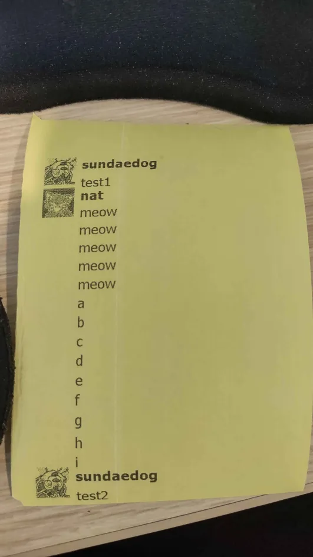

# receipt printer discord

who needs a screen anyway



unfortunately windows only. no plans to make it otherwise since the driver that this relies on is also windows only

## setup

1. create a discord bot on the [developer portal](https://discord.com/developers/home).
2. in the Bot menu, toggle on the "message content" intent and copy the bot's token.
3. create a file called `.env` in this directory, containing `TOKEN=[paste the token]`
4. configure the bot in `config.py` (the most important setting is the channel id)
5. run `run.bat`, or on powershell:

```powershell
python -m venv .venv
.venv\Scripts\Activate.ps1
pip install -r requirements.txt
python main.py
```
